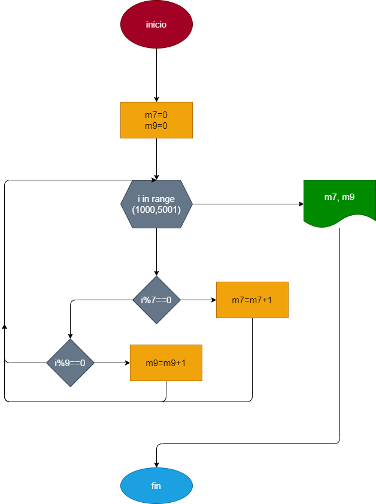

# Multiplos_7_9

# Hacer el diagrama de flujo y el programa en python que averigue e imprima cuantos multiplos de 7 y cuantos multiplos de 9 hay en los numeros comprenedidos entre el 1000 y el 5000

## Diagrama de flujo 

